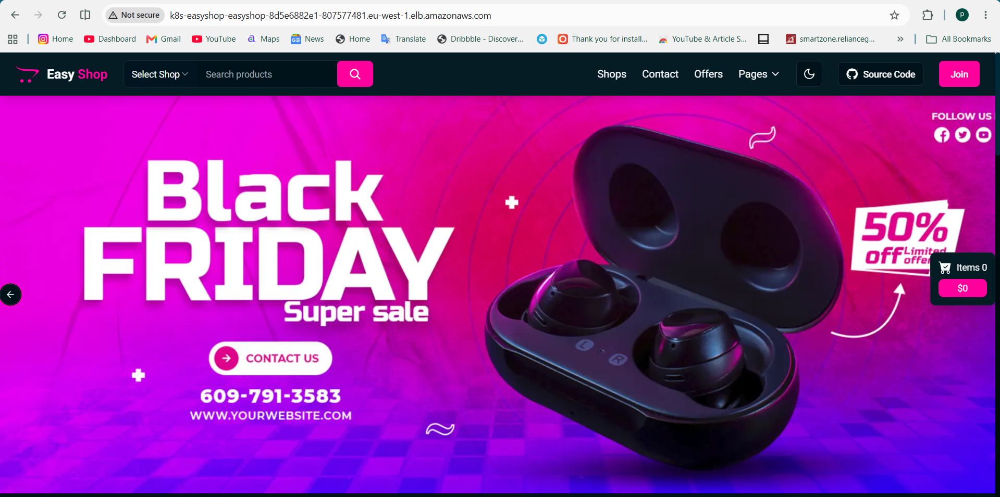
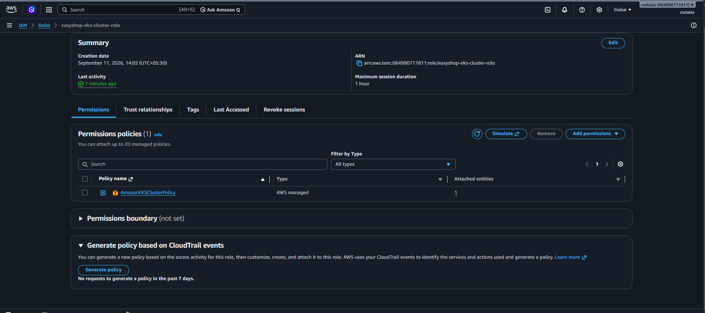

# 🛒 EasyShop DevSecOps & AWS EKS Deployment

> A production-style DevSecOps and cloud deployment implementation for the EasyShop application using Jenkins, SonarQube, Trivy, Docker, Amazon ECR, Amazon EKS, Kubernetes, AWS Application Load Balancer, Horizontal Pod Autoscaler, IAM, and CI/CD email notifications.

---

## 🚀 Project Overview

The **EasyShop DevSecOps & AWS EKS Deployment** project demonstrates an end-to-end cloud-native application delivery workflow using **Jenkins CI/CD, Docker, Amazon ECR, Amazon EKS, and Kubernetes**.

The project automates the application delivery lifecycle from source code integration and code-quality/security validation to container image creation, image publishing, Kubernetes deployment, external traffic routing, autoscaling, and deployment notifications.

The infrastructure is designed to simulate a real-world DevOps workflow with an emphasis on:

* CI/CD automation
* Containerization
* DevSecOps practices
* Kubernetes orchestration
* AWS cloud services
* Application networking
* Horizontal autoscaling
* IAM-based access control
* Deployment validation
* Operational visibility

### 🎯 Key Objectives

* Automate application build and deployment using Jenkins.
* Analyze application code using SonarQube.
* Perform vulnerability and secret scanning using Trivy.
* Containerize the application using Docker.
* Build and publish container images to Amazon ECR.
* Deploy the application on Amazon EKS using Kubernetes.
* Expose the application using AWS Application Load Balancer and Kubernetes Ingress.
* Configure Horizontal Pod Autoscaling for application workloads.
* Use AWS IAM for controlled access to AWS resources.
* Send CI/CD pipeline notifications through email.
* Validate Kubernetes workloads, services, ingress, and application availability.

---

## 🌐 Live Application

The **EasyShop** application is deployed on **Amazon EKS** and exposed through an **AWS Application Load Balancer**.

### Live Application

<p align="center">
  
</p>

### Additional Live Application View

<p align="center">
  
</p>

### Deployment Environment

| Component               | Implementation               |
| ----------------------- | ---------------------------- |
| Cloud Platform          | AWS                          |
| Kubernetes Platform     | Amazon EKS                   |
| Container Registry      | Amazon ECR                   |
| CI/CD                   | Jenkins                      |
| Containerization        | Docker                       |
| Code Quality            | SonarQube                    |
| Security Scanning       | Trivy                        |
| Ingress / Load Balancer | Kubernetes Ingress + AWS ALB |
| Autoscaling             | Kubernetes HPA               |
| Identity & Access       | AWS IAM                      |
| Operating Environment   | Linux                        |
| AWS Region              | `eu-west-1` (Ireland)        |

### Application Access

**Live Application Endpoint:**

`http://k8s-easyshop-easyshop-8d5e6882e1-807577481.eu-west-1.elb.amazonaws.com`

> **Note:** The public ALB DNS name is infrastructure-generated and may change if the AWS load-balancing resources are recreated.

---

# 🏗️ Solution Architecture

The EasyShop platform follows an automated DevSecOps deployment architecture where application source code moves through CI/CD automation, code-quality analysis, security scanning, containerization, image publishing, Kubernetes deployment, networking, and autoscaling.

### Architecture Flow

```text
Developer
    │
    ▼
GitHub Repository
    │
    ▼
Jenkins CI/CD
    │
    ├── Source Checkout
    ├── Build / Validation
    ├── SonarQube Analysis
    ├── Trivy Security Scan
    └── Docker Build
             │
             ▼
        Amazon ECR
             │
             ▼
        Amazon EKS
             │
       Kubernetes Workloads
             │
       ┌─────┼─────┐
       │     │     │
       ▼     ▼     ▼
 Deployment Service HPA
    │       │
    │       ▼
    │   Kubernetes
    │    Ingress
    │       │
    │       ▼
    │   AWS ALB
    │       │
    └───────┴──────► EasyShop
```

### AWS & Kubernetes Architecture

```text
                     AWS CLOUD
                         │
          ┌──────────────┴──────────────┐
          │                             │
          ▼                             ▼
      Amazon ECR                  Amazon EKS
   Container Registry          Kubernetes Cluster
          │                             │
          │                             ├── Deployment
          │                             ├── Pods
          │                             ├── Service
          │                             ├── Ingress
          │                             └── HPA
          │                                   │
          │                                   ▼
          │                           AWS Load Balancer
          │                                   │
          └───────────────►───────────────────┘
                                      │
                                      ▼
                                EasyShop Web App
```

### Key Architecture Components

| Layer              | Technology                   | Responsibility                    |
| ------------------ | ---------------------------- | --------------------------------- |
| Source Control     | GitHub                       | Application source management     |
| CI/CD              | Jenkins                      | Build and deployment automation   |
| Code Quality       | SonarQube                    | Static code analysis              |
| Security           | Trivy                        | Vulnerability and secret scanning |
| Containerization   | Docker                       | Application packaging             |
| Container Registry | Amazon ECR                   | Private image storage             |
| Orchestration      | Amazon EKS                   | Kubernetes workload management    |
| Networking         | Kubernetes Ingress + AWS ALB | External application access       |
| Scaling            | Kubernetes HPA               | Dynamic pod scaling               |
| Access Control     | AWS IAM                      | AWS resource permissions          |
| Notifications      | Jenkins Email / Gmail        | CI/CD execution notifications     |

---

# 🔄 DevSecOps CI/CD Pipeline

Jenkins acts as the central automation server for the EasyShop CI/CD workflow.

The pipeline connects source-code management, application validation, code-quality analysis, security scanning, Docker image creation, Amazon ECR publishing, and Kubernetes deployment.

### Jenkins Pipeline Architecture

```text
Developer
    │
    ▼
GitHub Repository
    │
    ▼
Jenkins Pipeline
    │
    ├── Checkout Source Code
    │
    ├── Build / Validation
    │
    ├── SonarQube Analysis
    │
    ├── Trivy Security Scan
    │
    ├── Docker Image Build
    │
    ├── Push Image to Amazon ECR
    │
    └── Deploy to Amazon EKS
             │
             ▼
        Kubernetes Workloads
```

### Jenkins Pipeline

<p align="center">
  
</p>

### Pipeline Stages

| Stage                 | Responsibility                                               |
| --------------------- | ------------------------------------------------------------ |
| Source Checkout       | Retrieves application source code from GitHub                |
| Build / Validation    | Validates application and build configuration                |
| SonarQube Analysis    | Performs static code-quality analysis                        |
| Trivy Security Scan   | Scans the project filesystem for vulnerabilities and secrets |
| Docker Build          | Creates the application container image                      |
| Image Push            | Publishes the image to Amazon ECR                            |
| Kubernetes Deployment | Deploys the application workload to Amazon EKS               |
| Validation            | Verifies Kubernetes and application availability             |

### CI/CD Benefits

* Automated and repeatable application delivery.
* Reduced manual deployment effort.
* Consistent Docker image creation.
* Integrated code-quality and security checks.
* Automated image publishing to Amazon ECR.
* Kubernetes-based deployment on Amazon EKS.
* Faster and more reliable application releases.

---

# 🔍 SonarQube Code Quality Analysis

SonarQube is integrated into the Jenkins CI/CD workflow to perform static code analysis and provide visibility into application code quality.

The analysis provides visibility into:

* Code quality
* Reliability
* Maintainability
* Security hotspots
* New code issues
* Quality Gate status

### SonarQube Dashboard

<p align="center">
  
</p>

<p align="center">
  
</p>

### Quality Gate

The latest EasyShop analysis reports a **Passed Quality Gate** with **0 new issues**.

This provides an additional quality-control stage before the application continues through the remaining CI/CD workflow.

---

# 📦 Amazon Elastic Container Registry — ECR

Amazon Elastic Container Registry (**Amazon ECR**) is used as the private container registry for the EasyShop application.

The Jenkins pipeline builds the Docker image and publishes the resulting image to the EasyShop ECR repository for consumption by Amazon EKS.

### Container Image Workflow

```text
Jenkins
   │
   ▼
Docker Build
   │
   ▼
Security Validation
   │
   ▼
Amazon ECR
   │
   ▼
Amazon EKS
```

### ECR Repository

<p align="center">
  
</p>

### Container Images

<p align="center">
  
</p>

### ECR Configuration

| Configuration     | Value                       |
| ----------------- | --------------------------- |
| Registry          | Amazon ECR Private Registry |
| Repository        | `easyshop`                  |
| AWS Region        | `eu-west-1`                 |
| Encryption        | AES-256                     |
| Tag Mutability    | Mutable                     |
| Deployment Target | Amazon EKS                  |

### ECR Benefits

* Private container image storage.
* Centralized Docker image management.
* Versioned image tags for deployments.
* Native integration with AWS services.
* Container images available for Amazon EKS workloads.

---

# ☸️ Amazon EKS — Kubernetes Runtime Platform

Amazon Elastic Kubernetes Service (**Amazon EKS**) provides the managed Kubernetes platform used to run the EasyShop application workloads on AWS.

The application container images published to **Amazon ECR** are deployed into the EKS cluster, where Kubernetes manages application workloads, services, networking, and horizontal scaling.

### EKS Deployment Architecture

```text
                    Amazon EKS
                        │
          ┌─────────────┴─────────────┐
          │                           │
          ▼                           ▼
    Kubernetes                  Compute Resources
     Workloads                    Worker Nodes
          │                           │
          └─────────────┬─────────────┘
                        │
                        ▼
                  EasyShop Pods
                        │
             ┌──────────┼──────────┐
             │          │          │
             ▼          ▼          ▼
         Service     Ingress      HPA
             │          │          │
             └──────────┼──────────┘
                        ▼
                     AWS ALB
```

### EKS Cluster

The EasyShop application is deployed on an **Amazon EKS cluster in the `eu-west-1` (Ireland) AWS region**.

<p align="center">
  
</p>

> Amazon EKS provides the Kubernetes runtime platform, while Amazon ECR provides the container images consumed by the workloads.

### EKS Compute Resources

<p align="center">
  
</p>

### Kubernetes Components

| Component                  | Responsibility                                  |
| -------------------------- | ----------------------------------------------- |
| Pods                       | Run EasyShop application containers             |
| Deployment                 | Maintains desired application replica state     |
| Service                    | Provides stable internal application networking |
| Ingress                    | Defines external HTTP routing                   |
| HPA                        | Dynamically adjusts application replicas        |
| Worker / Compute Resources | Provide runtime capacity                        |

### ECR → EKS Deployment Flow

```text
Docker Image
     │
     ▼
Amazon ECR
     │
     │ Image Pull
     ▼
Amazon EKS
     │
     ▼
Kubernetes Deployment
     │
     ▼
EasyShop Pods
     │
     ├── Service
     ├── Ingress
     └── HPA
```

---

# 🌐 AWS Application Load Balancer & Kubernetes Ingress

The EasyShop application is exposed through an **AWS Application Load Balancer (ALB)** integrated with **Kubernetes Ingress**.

This provides the external traffic path from the public internet to the EasyShop workloads running inside Amazon EKS.

### End-to-End Traffic Flow

```text
Internet
   │
   ▼
AWS Application Load Balancer
   │
   ▼
Kubernetes Ingress
   │
   ▼
Kubernetes Service
   │
   ▼
EasyShop Pods
```

### AWS Application Load Balancer

The AWS Application Load Balancer provides the public entry point for the EasyShop application.

<p align="center">
  
</p>

### Kubernetes Ingress

The Kubernetes Ingress defines the application routing configuration used to connect the external load balancer with the EasyShop service.

<p align="center">
  
</p>

### Verified Routing

```text
AWS ALB
   │
   ▼
easyshop-ingress
   │
   ▼
EasyShop Service
   │
   ▼
EasyShop Pods
```

### Networking Components

| Component          | Role                                    |
| ------------------ | --------------------------------------- |
| AWS ALB            | Internet-facing application entry point |
| Listener : 80      | Receives HTTP traffic                   |
| Kubernetes Ingress | Defines application routing             |
| Kubernetes Service | Provides stable workload access         |
| EasyShop Pods      | Serve the application                   |

---

# 📈 Horizontal Pod Autoscaling — HPA

The EasyShop application uses **Kubernetes Horizontal Pod Autoscaler (HPA)** to automatically adjust the number of application pods based on CPU utilization.

### HPA Configuration

| Configuration          | Value                 |
| ---------------------- | --------------------- |
| Target CPU Utilization | **50%**               |
| Minimum Replicas       | **1**                 |
| Maximum Replicas       | **10**                |
| Namespace              | `easyshop`            |
| Target Workload        | `Deployment/easyshop` |

### Current Runtime Status

At the time of screenshot capture, the HPA reported approximately **14% CPU utilization against a 50% target**, with **2 active replicas**.

> **Current replicas are runtime observations and can change automatically according to workload and HPA decisions.**

<p align="center">
  
</p>

### HPA Configuration Details

<p align="center">
  
</p>

### Scaling Behavior

```text
                 CPU Utilization
                        │
                        ▼
                HPA Evaluates Load
                        │
              ┌─────────┴─────────┐
              │                   │
          Higher Load         Lower Load
              │                   │
              ▼                   ▼
      Increase Replicas     Reduce Replicas
              │                   │
              └─────────┬─────────┘
                        ▼
                 EasyShop Deployment
```

### Scaling Benefits

* Automatically adjusts application replicas.
* Maintains a minimum of 1 replica.
* Supports scaling up to 10 replicas.
* Reduces manual pod-scaling operations.
* Helps maintain application availability during increased workload.
* Uses Kubernetes-native autoscaling.

---

# 🔐 IAM & Security

Security is integrated into the EasyShop AWS and CI/CD architecture through **AWS IAM, SonarQube, and Trivy**.

### AWS IAM Roles

The deployment uses dedicated IAM roles for AWS and Kubernetes-related components.

### Application Load Balancer Controller Role

The `AmazonEKSLoadBalancerControllerRole` provides permissions required by the AWS Load Balancer Controller to manage AWS load-balancing resources.

<p align="center">
  
</p>

### Amazon EKS Cluster Role

The EKS cluster uses a dedicated IAM service role for AWS integration.

<p align="center">
  
</p>

### Amazon EKS Node Role

Worker-node compute resources use a dedicated IAM role to interact with required AWS services.

<p align="center">
  
</p>

---

# 🛡️ Trivy Security Scanning

Trivy is integrated into the Jenkins CI/CD workflow to scan the **project filesystem for vulnerabilities and secrets**.

The configured scan focuses on **HIGH** and **CRITICAL** findings.

```bash
trivy fs --scanners vuln,secret --severity HIGH,CRITICAL --exit-code 0 .
```

<p align="center">
  
</p>

The captured scan reported **12 findings: 10 HIGH and 2 CRITICAL**.

These findings provide visibility into dependency and security risks that can be reviewed and remediated.

> **Note:** The current command uses `trivy fs`, so this documentation describes a filesystem vulnerability/secret scan rather than claiming a Docker image scan.

### Security Workflow

```text
Developer
    │
    ▼
GitHub
    │
    ▼
Jenkins
    │
    ├── SonarQube Analysis
    │
    ├── Trivy Filesystem Scan
    │
    ▼
Docker Image Build
    │
    ▼
Amazon ECR
    │
    ▼
Amazon EKS
```

### Security Practices

* Dedicated IAM roles for AWS and EKS components.
* Static code analysis through SonarQube.
* Filesystem vulnerability and secret scanning through Trivy.
* Version-controlled infrastructure and deployment configuration.
* Security findings made visible as part of the CI/CD workflow.

---

# 🐳 Docker Containerization

Docker is used to package the EasyShop application into a portable and reproducible container image.

The Jenkins pipeline automates the Docker build process and prepares the resulting image for publishing to Amazon ECR.

### Container Build Workflow

```text
Application Source
       │
       ▼
   Dockerfile
       │
       ▼
  Docker Build
       │
       ▼
 Docker Image
       │
       ▼
 Security Validation
       │
       ▼
 Amazon ECR
       │
       ▼
 Amazon EKS
```

### Docker Build

<p align="center">
  
</p>

### Container Delivery

After the Docker image is built and validated, it is published to the private **Amazon ECR `easyshop` repository** and becomes available for deployment on Amazon EKS.

### Docker Benefits

* Consistent application packaging.
* Portable containerized workloads.
* Reproducible builds through Dockerfiles.
* Easy CI/CD integration.
* Direct integration with Amazon ECR and Amazon EKS.

---

# 📧 CI/CD Notifications — Gmail

The EasyShop CI/CD pipeline is integrated with email notifications to provide visibility into Jenkins build and deployment results.

### Notification Workflow

```text
GitHub
   │
   ▼
Jenkins CI/CD Pipeline
   │
   ├── Build
   ├── SonarQube
   ├── Trivy
   ├── Docker
   ├── Amazon ECR
   └── Amazon EKS
            │
            ▼
      Pipeline Result
            │
            ▼
      Gmail Notification
```

### Jenkins Email Notification

<p align="center">
  
</p>

### Notification Information

The notification can provide information such as:

* Jenkins job name
* Build number
* Build status
* Pipeline execution result
* Build date and time
* Jenkins build reference

### Benefits

* Provides visibility into CI/CD execution.
* Helps track successful and failed builds.
* Reduces manual Jenkins monitoring.
* Improves deployment awareness.

---

# 📊 Kubernetes Workload Health

Kubernetes workload health is verified to ensure that the EasyShop application pods are running successfully inside Amazon EKS.

The deployment status can be checked using:

```bash
kubectl get pods -n easyshop
```

### Running Application Workload

<p align="center">
  
</p>

### Workload Health Checks

| Check         | Purpose                                        |
| ------------- | ---------------------------------------------- |
| Pod Status    | Confirms the application workload is running   |
| Ready Status  | Confirms containers are ready to serve traffic |
| Restart Count | Helps identify repeated container failures     |
| Namespace     | Confirms the workload is running in `easyshop` |

### Operational Visibility

Kubernetes workload checks provide a runtime validation layer and help identify workload failures during deployment and operation.

---

# 🧪 Deployment Validation

The EasyShop deployment is validated across multiple Kubernetes and AWS layers.

### Validation Flow

```text
Amazon EKS
    │
    ├── Pods
    │     └── Application Workload
    │
    ├── Service
    │     └── Internal Connectivity
    │
    ├── Ingress
    │     └── External Routing
    │
    └── HPA
          └── Application Scaling
```

### Kubernetes Service

The EasyShop application is exposed internally through a Kubernetes `ClusterIP` service on port `80`.

<p align="center">
  
</p>

### Validation Checks

| Validation         | Result                               |
| ------------------ | ------------------------------------ |
| Kubernetes Pod     | Running / Ready                      |
| Kubernetes Service | `ClusterIP` on port `80`             |
| Kubernetes Ingress | Configured with AWS ALB              |
| HPA                | Configured for `Deployment/easyshop` |
| External Access    | Available through AWS ALB            |

### Deployment Validation Commands

```bash
kubectl get pods -n easyshop
kubectl get svc -n easyshop
kubectl get ingress -n easyshop
kubectl get hpa -n easyshop
```

These checks validate the major Kubernetes resources involved in the EasyShop deployment.

---

# 🛠️ Technology Stack

The EasyShop platform combines DevOps, cloud, containerization, Kubernetes, security, and automation technologies.

### ☁️ Cloud & Infrastructure

| Category            | Technology                        |
| ------------------- | --------------------------------- |
| Cloud Platform      | **Amazon Web Services (AWS)**     |
| Container Registry  | **Amazon ECR**                    |
| Kubernetes Platform | **Amazon EKS**                    |
| Load Balancing      | **AWS Application Load Balancer** |
| Identity & Access   | **AWS IAM**                       |
| Region              | **eu-west-1 (Ireland)**           |

### 🔄 CI/CD & DevSecOps

| Category          | Technology                |
| ----------------- | ------------------------- |
| Source Control    | **Git, GitHub**           |
| CI/CD Automation  | **Jenkins**               |
| Code Quality      | **SonarQube**             |
| Security Scanning | **Trivy**                 |
| Notifications     | **Gmail / Jenkins Email** |

### 🐳 Containerization & Kubernetes

| Category              | Technology                          |
| --------------------- | ----------------------------------- |
| Containerization      | **Docker**                          |
| Orchestration         | **Kubernetes**                      |
| Kubernetes Networking | **Ingress**                         |
| Service Discovery     | **Kubernetes Services**             |
| Autoscaling           | **Horizontal Pod Autoscaler (HPA)** |

### 🖥️ Operating Environment

| Category         | Technology                |
| ---------------- | ------------------------- |
| Operating System | **Ubuntu Linux**          |
| CLI / Automation | **Linux Shell / kubectl** |
| Configuration    | **YAML**                  |

### DevOps Workflow

```text
GitHub
   ↓
Jenkins
   ↓
SonarQube
   ↓
Trivy
   ↓
Docker
   ↓
Amazon ECR
   ↓
Amazon EKS
   ↓
Kubernetes
   ↓
Ingress + AWS ALB
   ↓
HPA
   ↓
Gmail Notification
```

### ✨ Key Capabilities

* Automated CI/CD using Jenkins.
* Continuous code-quality analysis with SonarQube.
* Vulnerability and secret scanning with Trivy.
* Containerized application delivery using Docker.
* Private container image management through Amazon ECR.
* Managed Kubernetes deployment using Amazon EKS.
* External application routing using AWS ALB and Kubernetes Ingress.
* Kubernetes-based horizontal autoscaling using HPA.
* AWS IAM-based service access control.
* Automated CI/CD status notifications through email.

---

# 📁 Repository Structure

```text
easyshop-3tier-devsecops/
│
├── db/                         # Database-related resources
├── hpa-demo/                   # HPA demonstration resources
├── public/                     # Static application assets
├── screenshots/                # Project and deployment screenshots
├── scripts/                    # Automation and utility scripts
├── src/                        # EasyShop application source code
│
├── .dockerignore               # Docker build exclusions
├── .eslintrc.json              # ESLint configuration
├── .gitignore                  # Git ignore rules
│
├── Dockerfile                  # Container image definition
├── Jenkinsfile                 # Jenkins CI/CD pipeline
├── LICENSE                     # Project license
├── README.md                   # Project documentation
├── about.md                    # Project information
├── components.json             # UI/component configuration
│
├── easyshop-hpa.yaml           # Kubernetes Horizontal Pod Autoscaler
├── easyshop-ingress.yaml       # Kubernetes Ingress / AWS ALB configuration
├── easyshop-service.yaml       # Kubernetes Service configuration
├── k8s-deployment.yaml         # Kubernetes Deployment configuration
│
├── ecosystem.config.js         # Application process configuration
├── next.config.js              # Next.js configuration
├── package.json                # Application dependencies and scripts
├── package-lock.json           # Dependency lock file
├── postcss.config.js           # PostCSS configuration
├── sonar-project.properties    # SonarQube configuration
├── tailwind.config.ts          # Tailwind CSS configuration
└── tsconfig.json               # TypeScript configuration
```

> **Security note:** Local `.env` files are intentionally not listed as project documentation artifacts. Environment files containing credentials or secrets should remain untracked and should be protected through `.gitignore` and appropriate secret-management practices.

---

# 🔗 Configuration-to-Deployment Mapping

The repository configuration connects application source code, CI/CD automation, security analysis, containerization, and Kubernetes deployment.

| Repository Configuration   | DevOps / AWS Component             | Purpose                                                      |
| -------------------------- | ---------------------------------- | ------------------------------------------------------------ |
| `Dockerfile`               | Docker                             | Builds the EasyShop container image                          |
| `Jenkinsfile`              | Jenkins                            | Automates CI/CD pipeline execution                           |
| `sonar-project.properties` | SonarQube                          | Configures static code-quality analysis                      |
| Trivy pipeline stage       | Trivy                              | Performs filesystem vulnerability and secret scanning        |
| `k8s-deployment.yaml`      | Amazon EKS                         | Deploys EasyShop application pods                            |
| `easyshop-service.yaml`    | Kubernetes Service                 | Provides internal application networking                     |
| `easyshop-ingress.yaml`    | AWS Load Balancer Controller / ALB | Provides external application routing                        |
| `easyshop-hpa.yaml`        | Kubernetes HPA                     | Automatically scales application pods                        |
| `screenshots/`             | Deployment Evidence                | Stores AWS, Jenkins, Kubernetes, and application screenshots |

---

# 🔄 Complete DevSecOps & Infrastructure Flow

The complete workflow connects source code with Jenkins, security tools, Docker, Amazon ECR, Amazon EKS, Kubernetes networking, autoscaling, and the live application.

```text
                    ┌──────────────────────┐
                    │   Developer / GitHub │
                    └──────────┬───────────┘
                               │
                               ▼
                    ┌──────────────────────┐
                    │  EasyShop Source Code │
                    └──────────┬───────────┘
                               │
                               ▼
                    ┌──────────────────────┐
                    │       Jenkins        │
                    │     CI/CD Pipeline   │
                    └──────────┬───────────┘
                               │
                    ┌──────────┴───────────┐
                    │                      │
                    ▼                      ▼
             ┌─────────────┐        ┌─────────────┐
             │  SonarQube  │        │    Trivy    │
             │ Code Quality│        │  Security   │
             │   Analysis  │        │    Scan     │
             └──────┬──────┘        └──────┬──────┘
                    │                      │
                    └──────────┬───────────┘
                               ▼
                    ┌──────────────────────┐
                    │   Docker Image Build │
                    └──────────┬───────────┘
                               │
                               ▼
                    ┌──────────────────────┐
                    │      Amazon ECR      │
                    │  Container Registry  │
                    └──────────┬───────────┘
                               │
                               ▼
                    ┌──────────────────────┐
                    │      Amazon EKS      │
                    │  Kubernetes Cluster  │
                    └──────────┬───────────┘
                               │
                ┌──────────────┼──────────────┐
                │              │              │
                ▼              ▼              ▼
        ┌─────────────┐ ┌─────────────┐ ┌─────────────┐
        │ Deployment  │ │   Service   │ │    HPA      │
        │    Pods     │ │ Networking  │ │ Auto Scaling│
        └──────┬──────┘ └─────────────┘ └─────────────┘
               │
               ▼
        ┌─────────────────┐
        │ Kubernetes      │
        │ Ingress         │
        └────────┬────────┘
                 │
                 ▼
        ┌─────────────────┐
        │     AWS ALB     │
        │ Application LB  │
        └────────┬────────┘
                 │
                 ▼
        ┌─────────────────┐
        │    EasyShop     │
        │   Live Web App  │
        └─────────────────┘
```

---

# 🚀 End-to-End Deployment Workflow

EasyShop follows an automated **DevSecOps CI/CD workflow** integrating source control, code quality analysis, security scanning, containerization, AWS container registry, Kubernetes deployment, load balancing, autoscaling, and notifications.

### Pipeline Execution Stages

| Stage                    | Tool / Service        | Purpose                                                  |
| ------------------------ | --------------------- | -------------------------------------------------------- |
| 1. Source Checkout       | GitHub                | Retrieves application source code                        |
| 2. CI Pipeline           | Jenkins               | Automates the delivery workflow                          |
| 3. Code Quality          | SonarQube             | Analyzes application code quality                        |
| 4. Security Scan         | Trivy                 | Scans project filesystem for vulnerabilities and secrets |
| 5. Container Build       | Docker                | Creates the EasyShop container image                     |
| 6. Image Registry        | Amazon ECR            | Stores and manages the container image                   |
| 7. Kubernetes Deployment | Amazon EKS            | Runs the application workloads                           |
| 8. Service Exposure      | Kubernetes Service    | Provides internal application networking                 |
| 9. Traffic Routing       | Ingress / AWS ALB     | Routes external traffic                                  |
| 10. Auto Scaling         | Kubernetes HPA        | Dynamically adjusts application replicas                 |
| 11. Notification         | Gmail / Jenkins Email | Reports CI/CD execution results                          |

### DevSecOps Integration

```text
Source Code
     │
     ▼
Jenkins
     │
     ├── SonarQube
     │      └── Code Quality Analysis
     │
     └── Trivy
            └── Filesystem Vulnerability & Secret Scan
                    │
                    ▼
              Docker Image
                    │
                    ▼
                Amazon ECR
                    │
                    ▼
                Amazon EKS
```

### Kubernetes Deployment Flow

```text
Amazon EKS
    │
    ├── Deployment
    │      └── EasyShop Pods
    │
    ├── Service
    │      └── Internal Networking
    │
    ├── Ingress
    │      └── External Traffic Routing
    │
    └── HPA
           └── Automatic Pod Scaling
                    │
                    ▼
              AWS Application
              Load Balancer
                    │
                    ▼
              EasyShop Web App
```

### Auto Scaling Flow

```text
Low Traffic
    │
    ▼
Fewer Pods
    │
    ▼
Application Running
    │
    ▼
Increased CPU / Workload
    │
    ▼
HPA Detects Increased Load
    │
    ▼
Additional Pods Created
    │
    ▼
Traffic Distributed Through AWS ALB
```

### Deployment Validation

The deployment can be validated through:

* Jenkins pipeline execution status
* SonarQube Quality Gate
* Trivy security scan results
* Amazon ECR image availability
* Amazon EKS cluster status
* Kubernetes pod status
* Kubernetes Service status
* Kubernetes Ingress status
* AWS ALB availability
* HPA configuration and runtime status
* EasyShop live application accessibility
* Jenkins email notification

---

# 🎯 Final Deployment Result

The completed project demonstrates an end-to-end DevSecOps workflow:

```text
GitHub
   ↓
Jenkins
   ↓
SonarQube + Trivy
   ↓
Docker
   ↓
Amazon ECR
   ↓
Amazon EKS
   ↓
Kubernetes
   ↓
Service + Ingress
   ↓
AWS Application Load Balancer
   ↓
EasyShop
   ↓
HPA Auto Scaling
   ↓
Gmail Notification
```

The project demonstrates practical implementation of:

**Jenkins CI/CD + SonarQube + Trivy + Docker + Amazon ECR + Amazon EKS + Kubernetes + AWS ALB + Ingress + HPA + IAM + Email Notifications**

This project showcases an automated, cloud-native DevSecOps deployment workflow from **source code to a publicly accessible Kubernetes application on AWS**.

## 📄 License

This project is licensed under the [MIT License](LICENSE).

## 👨‍💻 Author

**Prasad Jadhav**

DevOps & Cloud Engineer — Fresher

* GitHub: https://github.com/prasads-3
* LinkedIn: https://www.linkedin.com/in/prasad-jadhav-19a35b413

---

⭐ If you found this project useful, feel free to star the repository.

