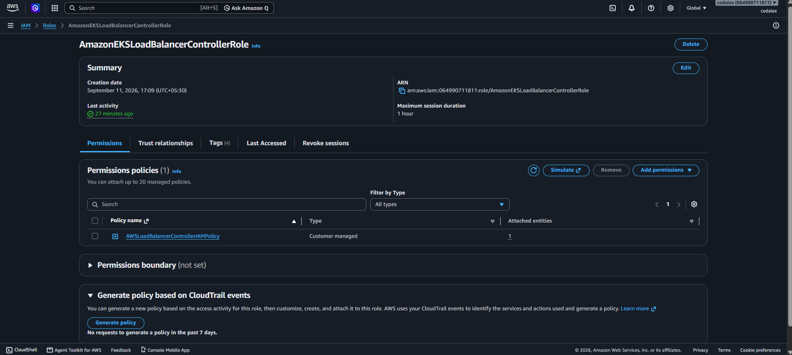
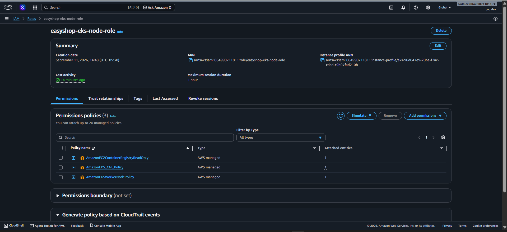
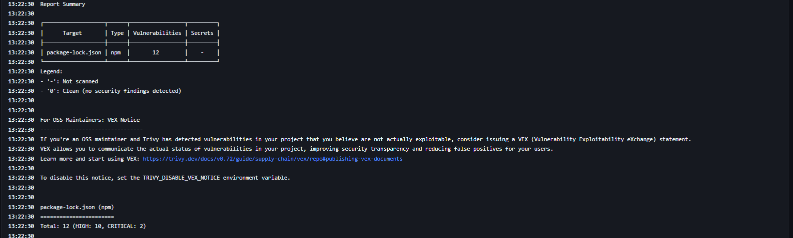
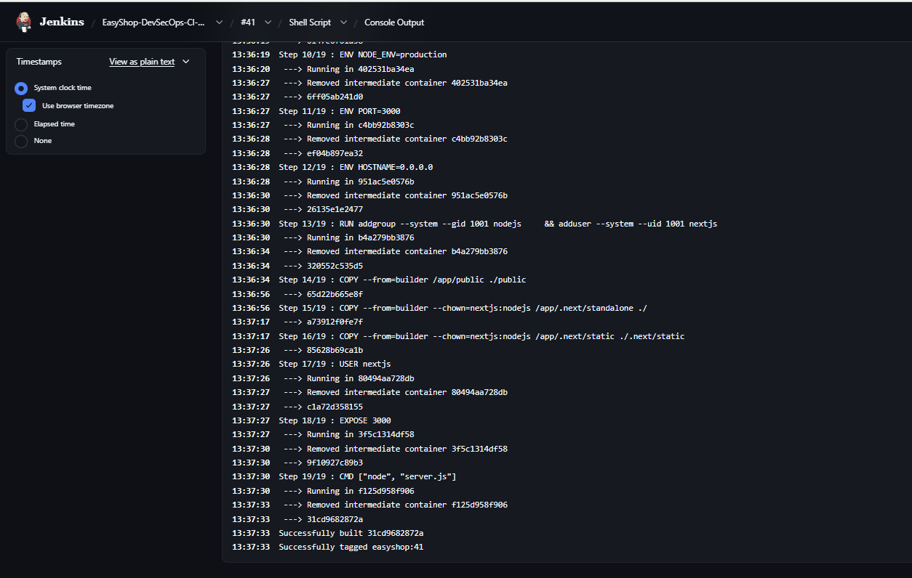
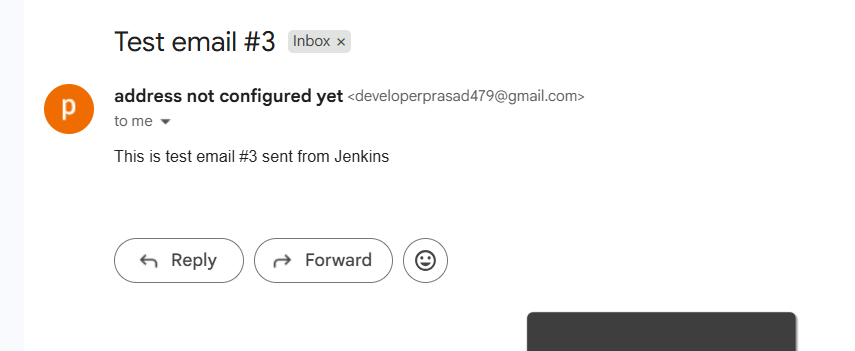
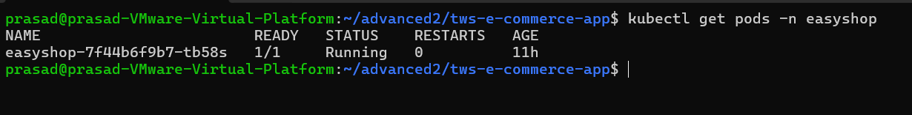
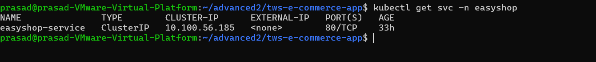

# 🛒 EasyShop DevSecOps & AWS EKS Deployment

> A production-style DevSecOps and cloud deployment implementation for the EasyShop application using Jenkins, Docker, Amazon ECR, Amazon EKS, Kubernetes, AWS Application Load Balancer, Horizontal Pod Autoscaler, IAM, and CI/CD email notifications.

---

## 🚀 Project Overview

The **EasyShop DevSecOps & AWS EKS Deployment** project demonstrates an end-to-end cloud-native application delivery workflow using **Jenkins CI/CD, Docker, Amazon ECR, Amazon EKS, and Kubernetes**.

The project automates the application delivery lifecycle from source code integration and container image creation to secure image publishing, Kubernetes deployment, external traffic routing, autoscaling, and deployment notifications.

The infrastructure is designed to simulate a real-world DevOps deployment workflow with an emphasis on **automation, containerization, Kubernetes orchestration, AWS cloud services, security, and operational reliability**.

### Key Objectives

* Automate application build and deployment using Jenkins.
* Containerize the application using Docker.
* Build and publish container images to Amazon ECR.
* Deploy the application on Amazon EKS using Kubernetes.
* Expose the application using AWS Application Load Balancer and Kubernetes Ingress.
* Configure Horizontal Pod Autoscaling for application workloads.
* Use AWS IAM for controlled access to cloud resources.
* Integrate security scanning into the CI/CD workflow.
* Send CI/CD pipeline notifications through email.
* Validate application health and Kubernetes deployment status.

---

## 🌐 Live Application

The **EasyShop** application is deployed on **Amazon EKS** and exposed through an **AWS Application Load Balancer**.

<p align="center">
  
</p>

### Deployment Environment

| Component               | Implementation                |
| ----------------------- | ----------------------------- |
| Cloud Platform          | AWS                           |
| Kubernetes              | Amazon EKS                    |
| Container Registry      | Amazon ECR                    |
| Ingress / Load Balancer | AWS Application Load Balancer |
| CI/CD                   | Jenkins                       |
| Containerization        | Docker                        |
| Autoscaling             | Kubernetes HPA                |
| Operating Environment   | Linux                         |

### Application Access

🔗 **Live Application:**
`http://k8s-easyshop-easyshop-8d5e6882e1-807577481.eu-west-1.elb.amazonaws.com`

---

## 🏗️ Solution Architecture

The EasyShop platform follows an automated DevSecOps deployment architecture where application source code moves through CI/CD, containerization, security validation, image publishing, Kubernetes deployment, networking, and autoscaling.

### End-to-End Architecture

<p align="center">
  
</p>

### Architecture Flow

```text
Developer
    │
    ▼
GitHub Repository
    │
    ▼
Jenkins CI/CD
    │
    ├── Checkout
    ├── Build
    ├── Security Scan
    └── Docker Build
             │
             ▼
        Amazon ECR
             │
             ▼
        Amazon EKS
             │
       Kubernetes Workloads
             │
        ┌────┴────┐
        │         │
     Service     HPA
        │
        ▼
 Kubernetes Ingress
        │
        ▼
AWS Application Load Balancer
        │
        ▼
🌐 EasyShop Application
```

### Key Architecture Components

| Layer              | Technology                   | Responsibility                            |
| ------------------ | ---------------------------- | ----------------------------------------- |
| Source Control     | GitHub                       | Application source management             |
| CI/CD              | Jenkins                      | Build and deployment automation           |
| Containerization   | Docker                       | Application packaging                     |
| Container Registry | Amazon ECR                   | Secure image storage                      |
| Orchestration      | Amazon EKS                   | Kubernetes workload management            |
| Networking         | Kubernetes Ingress + AWS ALB | External application access               |
| Scaling            | Kubernetes HPA               | Dynamic pod scaling                       |
| Security           | IAM + Trivy                  | Access control and vulnerability scanning |
| Notifications      | Gmail                        | CI/CD pipeline notifications              |

---

---

## 🔄 DevSecOps CI/CD Pipeline

The EasyShop project uses **Jenkins** as the central CI/CD automation server.

The pipeline automates the application delivery process by retrieving the source code, validating the application, performing security checks, building the Docker image, publishing the image to Amazon ECR, and preparing the application for deployment on Amazon EKS.

### Jenkins Pipeline Architecture

```text
Developer
    │
    ▼
GitHub Repository
    │
    ▼
Jenkins Pipeline
    │
    ├── Checkout Source Code
    │
    ├── Build / Validation
    │
    ├── Security Scan
    │
    ├── Docker Image Build
    │
    ├── Push Image to Amazon ECR
    │
    └── Kubernetes Deployment
             │
             ▼
        Amazon EKS
```

### Jenkins Pipeline Stage View

<p align="center">
  
</p>

### Pipeline Stages

| Stage              | Responsibility                                                   |
| ------------------ | ---------------------------------------------------------------- |
| Source Checkout    | Retrieves the latest source code from GitHub                     |
| Build / Validation | Validates the application and build configuration                |
| Security Scan      | Scans the application or container artifacts for security issues |
| Docker Build       | Creates the application container image                          |
| Image Push         | Publishes the Docker image to Amazon ECR                         |
| Deployment         | Deploys the application workload to Amazon EKS                   |
| Validation         | Verifies the deployment and application availability             |

### CI/CD Benefits

* Automated and repeatable application delivery.
* Reduced manual deployment effort.
* Consistent Docker image creation.
* Integrated security validation.
* Automated image publishing to Amazon ECR.
* Kubernetes-based deployment on Amazon EKS.
* Faster and more reliable application releases.

---

### 🔍 SonarQube Code Quality Analysis

SonarQube is integrated into the Jenkins CI/CD pipeline to perform static code analysis and evaluate the quality and security of the application code before the deployment workflow continues.

The analysis provides visibility into:

* Code quality
* Reliability
* Maintainability
* Security hotspots
* New code issues
* Quality Gate status

### SonarQube Dashboard

<p align="center">
  
</p>

<p align="center">
  
</p>


The EasyShop project is continuously analyzed by SonarQube as part of the CI/CD workflow.

### ✅ SonarQube Quality Gate

The latest EasyShop analysis reports a **Passed Quality Gate** with **0 new issues**, allowing the CI/CD workflow to proceed through the remaining stages.

### CI/CD Benefits

* Automated and repeatable application delivery.
* Reduced manual deployment effort.
* Consistent Docker image creation.
* Integrated code quality and security analysis.
* Automated publishing of container images to Amazon ECR.
* Kubernetes-based deployment on Amazon EKS.
* Faster and more reliable application releases.


## 📦 Amazon Elastic Container Registry (ECR)

Amazon Elastic Container Registry (Amazon ECR) is used as the private container registry for the EasyShop application.

The Jenkins CI/CD pipeline builds the application container image, performs the required validation and security checks, and publishes the image to the EasyShop ECR repository.

### Container Image Workflow

```text
Jenkins
   │
   ▼
Docker Build
   │
   ▼
Security Scan
   │
   ▼
Amazon ECR
   │
   ▼
Amazon EKS
```

### ECR Repository

The EasyShop application uses a private Amazon ECR repository to store and manage its container images.

<p align="center">
  
</p>

### Container Images

The ECR repository contains the container images used by the EasyShop Kubernetes deployment.

<p align="center">
  
</p>

### ECR Configuration

| Configuration     | Value                       |
| ----------------- | --------------------------- |
| Registry          | Amazon ECR Private Registry |
| Repository        | `easyshop`                  |
| AWS Region        | `eu-west-1`                 |
| Encryption        | AES-256                     |
| Tag Mutability    | Mutable                     |
| Deployment Target | Amazon EKS                  |

### ECR Benefits

* Private container image storage.
* Centralized Docker image management.
* Versioned image tags for deployments.
* Native integration with AWS services.
* Container images available for Amazon EKS workloads.

---

## ☸️ Amazon EKS — Kubernetes Runtime Platform

Amazon Elastic Kubernetes Service (Amazon EKS) provides the managed Kubernetes platform used to run the EasyShop application workloads on AWS.

The application containers published to **Amazon ECR** are deployed into the EKS cluster, where Kubernetes manages workload scheduling, service connectivity, application availability, and horizontal scaling.

### 🧩 EKS Deployment Architecture

```text
                 Amazon EKS
                     │
          ┌──────────┴──────────┐
          │                     │
          ▼                     ▼
     Kubernetes            Compute Resources
      Workloads             / Worker Nodes
          │                     │
          └──────────┬──────────┘
                     │
                     ▼
              EasyShop Pods
                     │
          ┌──────────┼──────────┐
          │          │          │
          ▼          ▼          ▼
       Service    Ingress      HPA
          │          │          │
          └──────────┼──────────┘
                     ▼
              AWS ALB / Internet
```

### ☁️ EKS Cluster Overview

The EasyShop application is deployed on an **Amazon EKS cluster in the `eu-west-1` (Ireland) AWS region**.

<p align="center">
  
</p>

> **Amazon EKS acts as the Kubernetes runtime platform, while Amazon ECR provides the container images consumed by the application workloads.**

### 🖥️ EKS Compute Resources

The cluster compute resources provide the runtime capacity required to execute the EasyShop Kubernetes workloads.

<p align="center">
  
</p>

### ⚙️ What EKS Manages

| Kubernetes Layer      | Responsibility                                    |
| --------------------- | ------------------------------------------------- |
| **Pods**              | Run the EasyShop application containers           |
| **Deployments**       | Maintain the desired application replica state    |
| **Services**          | Provide stable communication between workloads    |
| **Ingress**           | Route external HTTP/HTTPS traffic                 |
| **HPA**               | Dynamically adjust application replicas           |
| **Compute Resources** | Provide runtime capacity for Kubernetes workloads |

### 🔄 ECR → EKS Deployment Flow

```text
Docker Image
     │
     ▼
Amazon ECR
     │
     │  Image Pull
     ▼
Amazon EKS
     │
     ▼
Kubernetes Deployment
     │
     ▼
EasyShop Pods
     │
     ├── Service
     ├── Ingress
     └── HPA
```

### 🚀 Why Amazon EKS?

Amazon EKS provides the Kubernetes foundation for the project while integrating the application runtime with AWS-native services such as **IAM, networking, load balancing, and container registry**.

This architecture enables a scalable and repeatable container deployment model while keeping the application configuration managed through Kubernetes manifests.

---

## 🌐 AWS Application Load Balancer & Kubernetes Ingress

The EasyShop application is exposed to the internet through an **AWS Application Load Balancer (ALB)** integrated with **Kubernetes Ingress**.

This networking layer provides a controlled path for external traffic to reach the application workloads running inside the Amazon EKS cluster.

### 🌍 End-to-End Traffic Flow

```text
                    Internet
                       │
                       ▼
        ┌─────────────────────────────┐
        │ AWS Application Load        │
        │ Balancer                    │
        └─────────────────────────────┘
                       │
                       ▼
              Kubernetes Ingress
                  easyshop-ingress
                       │
                       ▼
              Kubernetes Service
                       │
                       ▼
                EasyShop Pods
```

### ⚖️ AWS Application Load Balancer

The AWS Application Load Balancer is configured as an **internet-facing Application Load Balancer** and provides the public entry point for the EasyShop application.

<p align="center">
  
</p>

### ☸️ Kubernetes Ingress

Kubernetes Ingress defines the routing configuration used to connect the AWS load balancer with the EasyShop Kubernetes service.

The ingress is associated with the AWS Load Balancer and exposes the application on **HTTP port 80**.

<p align="center">
  
</p>

### 🔗 Verified Routing

The Kubernetes ingress resolves to the same AWS Load Balancer DNS endpoint used to expose the live application.

```text
AWS ALB
   │
   ▼
easyshop-ingress
   │
   ▼
EasyShop Service
   │
   ▼
EasyShop Pods
```

### ✅ Networking Components

| Component              | Role                            |
| ---------------------- | ------------------------------- |
| **AWS ALB**            | Internet-facing entry point     |
| **Listener : 80**      | Receives HTTP traffic           |
| **Kubernetes Ingress** | Defines application routing     |
| **Kubernetes Service** | Provides stable workload access |
| **EasyShop Pods**      | Serve the application           |

### 🚀 Result

## This integration provides a clean cloud-native traffic path from the public internet to the EasyShop workloads running on Amazon EKS, while keeping the application routing configuration managed through Kubernetes.

## 📈 Horizontal Pod Autoscaling (HPA)

The EasyShop application uses **Kubernetes Horizontal Pod Autoscaler (HPA)** to automatically adjust the number of application pods based on CPU utilization.

This allows the application workload to scale dynamically according to resource demand while maintaining the desired application performance.

### ⚙️ HPA Configuration

The current EasyShop HPA configuration uses:

| Configuration          |                 Value |
| ---------------------- | --------------------: |
| Target CPU Utilization |               **50%** |
| Minimum Replicas       |                 **1** |
| Maximum Replicas       |                **10** |
| Current Replicas       |                 **2** |
| Namespace              |            `easyshop` |
| Target Workload        | `Deployment/easyshop` |

### 📊 HPA Status

The current HPA status shows the application operating at approximately **14% CPU utilization against a 50% target**, with 2 active replicas.

<p align="center">
  
</p>

### 🔍 HPA Configuration Details

The detailed Kubernetes HPA configuration provides visibility into the scaling policy, resource targets, replica limits, and current scaling conditions.

<p align="center">
  
</p>

### 🔄 Scaling Behavior

```text
                 CPU Utilization
                        │
                        ▼
                HPA Evaluates Load
                        │
              ┌─────────┴─────────┐
              │                   │
          Higher Load         Lower Load
              │                   │
              ▼                   ▼
      Increase Replicas     Reduce Replicas
              │                   │
              └─────────┬─────────┘
                        ▼
                 EasyShop Deployment
```

### 🚀 Scaling Benefits

* Automatically adjusts application replicas based on resource utilization.
* Maintains a minimum of 1 replica.
* Supports scaling up to 10 replicas.
* Reduces the need for manual pod scaling.
* Improves application availability during increased workload demand.
* Uses Kubernetes-native autoscaling capabilities.

---

## 🔐 IAM & Security

Security is integrated into the EasyShop AWS and CI/CD architecture through **AWS IAM**, **SonarQube**, and **Trivy**.

AWS IAM controls access between AWS services, while SonarQube and Trivy provide automated code-quality and security analysis during the software delivery lifecycle.

### 🔑 AWS IAM Roles

The EasyShop deployment uses dedicated IAM roles for AWS and Kubernetes components.

#### Application Load Balancer Controller Role

The `AmazonEKSLoadBalancerControllerRole` provides the IAM permissions required by the AWS Load Balancer Controller to manage AWS load-balancing resources for the Kubernetes environment.

<p align="center">
  
</p>

#### Amazon EKS Cluster Role

The EKS cluster uses a dedicated IAM service role for cluster-level AWS integration.

<p align="center">
  
</p>

#### Amazon EKS Node Role

Worker node compute resources use a dedicated IAM role to interact with required AWS services.

<p align="center">
  
</p>

### 🛡️ Trivy Security Scanning

Trivy is integrated into the Jenkins CI/CD workflow to scan the project filesystem for vulnerabilities and secrets.

The pipeline runs a focused scan for **HIGH** and **CRITICAL** vulnerabilities.

```bash
trivy fs --scanners vuln,secret --severity HIGH,CRITICAL --exit-code 0 .
```

<p align="center">
  
</p>

The latest scan identified dependency vulnerabilities in the project, including **12 findings: 10 HIGH and 2 CRITICAL**. These results provide visibility into dependency risk and highlight packages that require remediation.

### 🔍 Security Workflow

```text
Developer
    │
    ▼
GitHub
    │
    ▼
Jenkins
    │
    ├── SonarQube Analysis
    │
    ├── Trivy Security Scan
    │
    ▼
Docker Image Build
    │
    ▼
Amazon ECR
    │
    ▼
Amazon EKS
```

### ✅ Security Practices

* Dedicated IAM roles for AWS and EKS components.
* Static code analysis through SonarQube.
* Filesystem vulnerability and secret scanning through Trivy.
* Version-controlled infrastructure and deployment configuration.
* Security findings reviewed as part of the CI/CD workflow.

---

## 🐳 Docker Containerization

Docker is used to package the EasyShop application into a portable and reproducible container image.

The Jenkins CI/CD pipeline automates the container build process and prepares the resulting image for publishing to **Amazon ECR**.

### 🧱 Container Build Workflow

```text
Application Source
       │
       ▼
   Dockerfile
       │
       ▼
  Docker Build
       │
       ▼
 Docker Image
       │
       ▼
 Security Scan
       │
       ▼
 Amazon ECR
       │
       ▼
 Amazon EKS
```

### 🔨 Docker Build

The application container image is created as part of the Jenkins CI/CD workflow.

<p align="center">
  
</p>

### 📦 Container Delivery

After the Docker image is built and validated, it is published to the private **Amazon ECR `easyshop` repository** and becomes available for deployment on Amazon EKS.

### Docker Benefits

* Consistent application packaging.
* Portable containerized workloads.
* Reproducible builds through Dockerfiles.
* Easy integration with CI/CD pipelines.
* Direct integration with Amazon ECR and Amazon EKS.

---

## 📧 CI/CD Notifications — Gmail

The EasyShop CI/CD pipeline is integrated with email notifications to provide visibility into Jenkins build and deployment results.

After the pipeline execution is completed, Jenkins sends a notification containing the build result and job information.

### 🔔 Notification Workflow

```text
GitHub
   │
   ▼
Jenkins CI/CD Pipeline
   │
   ├── Build
   ├── SonarQube
   ├── Trivy
   ├── Docker
   ├── Amazon ECR
   └── Amazon EKS
            │
            ▼
      Pipeline Result
            │
            ▼
        Gmail Notification
```

### 📩 Jenkins Email Notification

The Jenkins notification provides a convenient way to track the CI/CD pipeline outcome without manually checking the Jenkins dashboard.

<p align="center">
  
</p>

### 📋 Notification Information

The email notification can provide details such as:

* Jenkins job name
* Build number
* Build status
* Pipeline execution result
* Build date and time
* Link to the Jenkins build

### 🚀 Benefits

* Provides immediate visibility into CI/CD execution.
* Helps track successful and failed builds.
* Reduces the need for manual Jenkins monitoring.
* Improves deployment awareness and operational visibility.

---
## 📊 Kubernetes Workload Health

Kubernetes workload health is continuously verified to ensure that the EasyShop application pods are running successfully inside the Amazon EKS cluster.

The deployment status can be checked using Kubernetes resource information:

```bash
kubectl get pods -n easyshop
```

### 🟢 Running Application Workload

The current EasyShop deployment shows the application pod in a **Running** state with the container reported as ready.

<p align="center">
  
</p>

### Workload Health Checks

| Check             | Purpose                                                      |
| ----------------- | ------------------------------------------------------------ |
| **Pod Status**    | Confirms application workload is running                     |
| **Ready Status**  | Confirms the container is ready to serve traffic             |
| **Restart Count** | Helps identify repeated container failures                   |
| **Namespace**     | Confirms the workload is running in the `easyshop` namespace |

### Operational Visibility

This Kubernetes-level health check provides a simple validation layer for the application runtime and helps identify workload failures before investigating deeper application-level issues.

---
## 🧪 Deployment Validation

The EasyShop deployment is validated at multiple Kubernetes layers to confirm that the application workload, service, ingress routing, and autoscaling configuration are operating as expected inside the Amazon EKS environment.

### ✅ Validation Overview

```text id="79f9cd"
Amazon EKS
    │
    ├── Pods
    │     └── Application Workload
    │
    ├── Service
    │     └── Internal Connectivity
    │
    ├── Ingress
    │     └── External Routing
    │
    └── HPA
          └── Application Scaling
```

### ☸️ Kubernetes Workloads

The EasyShop application pod is verified using Kubernetes workload status.

<p align="center">
  
</p>

### 🔗 Kubernetes Service

The application is exposed internally through a Kubernetes `ClusterIP` service on port `80`.

<p align="center">
  
</p>

### 🌐 Ingress Validation

The Kubernetes ingress is associated with the AWS Application Load Balancer and provides the external routing path to the EasyShop application.

<p align="center">
  
</p>

### 📈 HPA Validation

The Horizontal Pod Autoscaler is configured for the EasyShop deployment and provides automatic replica scaling based on CPU utilization.

<p align="center">
  
</p>

### 🔍 Validation Checks

| Validation         | Result                               |
| ------------------ | ------------------------------------ |
| Kubernetes Pod     | Running / Ready                      |
| Kubernetes Service | `ClusterIP` on port `80`             |
| Kubernetes Ingress | Configured with AWS ALB              |
| HPA                | Configured for `Deployment/easyshop` |
| External Access    | Available through AWS ALB            |

### 🚀 Deployment Result

These checks provide evidence that the EasyShop workload is deployed on Amazon EKS, internally exposed through Kubernetes Service, externally routed through the AWS ALB and Ingress layer, and configured for horizontal scaling.

## 🛠️ Technology Stack

The EasyShop platform combines modern DevOps, cloud, containerization, Kubernetes, security, and automation technologies to implement an end-to-end application delivery workflow.

### ☁️ Cloud & Infrastructure

| Category            | Technology                        |
| ------------------- | --------------------------------- |
| Cloud Platform      | **Amazon Web Services (AWS)**     |
| Container Registry  | **Amazon ECR**                    |
| Kubernetes Platform | **Amazon EKS**                    |
| Load Balancing      | **AWS Application Load Balancer** |
| Identity & Access   | **AWS IAM**                       |
| Region              | **eu-west-1 (Ireland)**           |

### 🔄 CI/CD & DevSecOps

| Category          | Technology                |
| ----------------- | ------------------------- |
| Source Control    | **Git, GitHub**           |
| CI/CD Automation  | **Jenkins**               |
| Code Quality      | **SonarQube**             |
| Security Scanning | **Trivy**                 |
| Notifications     | **Gmail / Jenkins Email** |

### 🐳 Containerization & Kubernetes

| Category              | Technology                          |
| --------------------- | ----------------------------------- |
| Containerization      | **Docker**                          |
| Orchestration         | **Kubernetes**                      |
| Kubernetes Networking | **Ingress**                         |
| Service Discovery     | **Kubernetes Services**             |
| Autoscaling           | **Horizontal Pod Autoscaler (HPA)** |

### 🖥️ Operating Environment

| Category         | Technology                |
| ---------------- | ------------------------- |
| Operating System | **Ubuntu Linux**          |
| CLI / Automation | **Linux Shell / kubectl** |
| Configuration    | **YAML**                  |

### 🚀 DevOps Workflow

```text
GitHub
   ↓
Jenkins
   ↓
SonarQube
   ↓
Trivy
   ↓
Docker
   ↓
Amazon ECR
   ↓
Amazon EKS
   ↓
Kubernetes
   ↓
Ingress + AWS ALB
   ↓
HPA
   ↓
Gmail Notification
```

### ✨ Key Capabilities

* Automated CI/CD using Jenkins.
* Continuous code-quality analysis with SonarQube.
* Automated vulnerability and secret scanning with Trivy.
* Containerized application delivery using Docker.
* Private container image management through Amazon ECR.
* Managed Kubernetes deployment using Amazon EKS.
* External application routing using AWS ALB and Kubernetes Ingress.
* Kubernetes-based horizontal autoscaling using HPA.
* AWS IAM-based service access control.
* Automated CI/CD status notifications through email.

---
