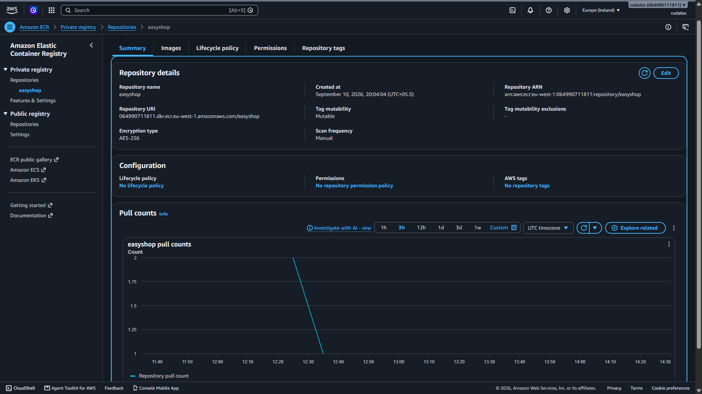

# 🛒 EasyShop DevSecOps & AWS EKS Deployment

> A production-style DevSecOps and cloud deployment implementation for the EasyShop application using Jenkins, Docker, Amazon ECR, Amazon EKS, Kubernetes, AWS Application Load Balancer, Horizontal Pod Autoscaler, IAM, and CI/CD email notifications.

---

## 🚀 Project Overview

The **EasyShop DevSecOps & AWS EKS Deployment** project demonstrates an end-to-end cloud-native application delivery workflow using **Jenkins CI/CD, Docker, Amazon ECR, Amazon EKS, and Kubernetes**.

The project automates the application delivery lifecycle from source code integration and container image creation to secure image publishing, Kubernetes deployment, external traffic routing, autoscaling, and deployment notifications.

The infrastructure is designed to simulate a real-world DevOps deployment workflow with an emphasis on **automation, containerization, Kubernetes orchestration, AWS cloud services, security, and operational reliability**.

### Key Objectives

* Automate application build and deployment using Jenkins.
* Containerize the application using Docker.
* Build and publish container images to Amazon ECR.
* Deploy the application on Amazon EKS using Kubernetes.
* Expose the application using AWS Application Load Balancer and Kubernetes Ingress.
* Configure Horizontal Pod Autoscaling for application workloads.
* Use AWS IAM for controlled access to cloud resources.
* Integrate security scanning into the CI/CD workflow.
* Send CI/CD pipeline notifications through email.
* Validate application health and Kubernetes deployment status.

---

## 🌐 Live Application

The **EasyShop** application is deployed on **Amazon EKS** and exposed through an **AWS Application Load Balancer**.

<p align="center">
  
</p>

### Deployment Environment

| Component               | Implementation                |
| ----------------------- | ----------------------------- |
| Cloud Platform          | AWS                           |
| Kubernetes              | Amazon EKS                    |
| Container Registry      | Amazon ECR                    |
| Ingress / Load Balancer | AWS Application Load Balancer |
| CI/CD                   | Jenkins                       |
| Containerization        | Docker                        |
| Autoscaling             | Kubernetes HPA                |
| Operating Environment   | Linux                         |

### Application Access

🔗 **Live Application:**
`http://k8s-easyshop-easyshop-8d5e6882e1-807577481.eu-west-1.elb.amazonaws.com`

---

## 🏗️ Solution Architecture

The EasyShop platform follows an automated DevSecOps deployment architecture where application source code moves through CI/CD, containerization, security validation, image publishing, Kubernetes deployment, networking, and autoscaling.

### End-to-End Architecture

<p align="center">
  
</p>

### Architecture Flow

```text
Developer
    │
    ▼
GitHub Repository
    │
    ▼
Jenkins CI/CD
    │
    ├── Checkout
    ├── Build
    ├── Security Scan
    └── Docker Build
             │
             ▼
        Amazon ECR
             │
             ▼
        Amazon EKS
             │
       Kubernetes Workloads
             │
        ┌────┴────┐
        │         │
     Service     HPA
        │
        ▼
 Kubernetes Ingress
        │
        ▼
AWS Application Load Balancer
        │
        ▼
🌐 EasyShop Application
```

### Key Architecture Components

| Layer              | Technology                   | Responsibility                            |
| ------------------ | ---------------------------- | ----------------------------------------- |
| Source Control     | GitHub                       | Application source management             |
| CI/CD              | Jenkins                      | Build and deployment automation           |
| Containerization   | Docker                       | Application packaging                     |
| Container Registry | Amazon ECR                   | Secure image storage                      |
| Orchestration      | Amazon EKS                   | Kubernetes workload management            |
| Networking         | Kubernetes Ingress + AWS ALB | External application access               |
| Scaling            | Kubernetes HPA               | Dynamic pod scaling                       |
| Security           | IAM + Trivy                  | Access control and vulnerability scanning |
| Notifications      | Gmail                        | CI/CD pipeline notifications              |

---

---

## 🔄 DevSecOps CI/CD Pipeline

The EasyShop project uses **Jenkins** as the central CI/CD automation server.

The pipeline automates the application delivery process by retrieving the source code, validating the application, performing security checks, building the Docker image, publishing the image to Amazon ECR, and preparing the application for deployment on Amazon EKS.

### Jenkins Pipeline Architecture

```text
Developer
    │
    ▼
GitHub Repository
    │
    ▼
Jenkins Pipeline
    │
    ├── Checkout Source Code
    │
    ├── Build / Validation
    │
    ├── Security Scan
    │
    ├── Docker Image Build
    │
    ├── Push Image to Amazon ECR
    │
    └── Kubernetes Deployment
             │
             ▼
        Amazon EKS
```

### Jenkins Pipeline Stage View

<p align="center">
  
</p>

### Pipeline Stages

| Stage              | Responsibility                                                   |
| ------------------ | ---------------------------------------------------------------- |
| Source Checkout    | Retrieves the latest source code from GitHub                     |
| Build / Validation | Validates the application and build configuration                |
| Security Scan      | Scans the application or container artifacts for security issues |
| Docker Build       | Creates the application container image                          |
| Image Push         | Publishes the Docker image to Amazon ECR                         |
| Deployment         | Deploys the application workload to Amazon EKS                   |
| Validation         | Verifies the deployment and application availability             |

### CI/CD Benefits

* Automated and repeatable application delivery.
* Reduced manual deployment effort.
* Consistent Docker image creation.
* Integrated security validation.
* Automated image publishing to Amazon ECR.
* Kubernetes-based deployment on Amazon EKS.
* Faster and more reliable application releases.

---

### 🔍 SonarQube Code Quality Analysis

SonarQube is integrated into the Jenkins CI/CD pipeline to perform static code analysis and evaluate the quality and security of the application code before the deployment workflow continues.

The analysis provides visibility into:

* Code quality
* Reliability
* Maintainability
* Security hotspots
* New code issues
* Quality Gate status

### SonarQube Dashboard

<p align="center">
  
</p>

<p align="center">
  
</p>


The EasyShop project is continuously analyzed by SonarQube as part of the CI/CD workflow.

### ✅ SonarQube Quality Gate

The latest EasyShop analysis reports a **Passed Quality Gate** with **0 new issues**, allowing the CI/CD workflow to proceed through the remaining stages.

### CI/CD Benefits

* Automated and repeatable application delivery.
* Reduced manual deployment effort.
* Consistent Docker image creation.
* Integrated code quality and security analysis.
* Automated publishing of container images to Amazon ECR.
* Kubernetes-based deployment on Amazon EKS.
* Faster and more reliable application releases.


## 📦 Amazon Elastic Container Registry (ECR)

Amazon Elastic Container Registry (Amazon ECR) is used as the private container registry for the EasyShop application.

The Jenkins CI/CD pipeline builds the application container image, performs the required validation and security checks, and publishes the image to the EasyShop ECR repository.

### Container Image Workflow

```text
Jenkins
   │
   ▼
Docker Build
   │
   ▼
Security Scan
   │
   ▼
Amazon ECR
   │
   ▼
Amazon EKS
```

### ECR Repository

The EasyShop application uses a private Amazon ECR repository to store and manage its container images.

<p align="center">
  
</p>

### Container Images

The ECR repository contains the container images used by the EasyShop Kubernetes deployment.

<p align="center">
  
</p>

### ECR Configuration

| Configuration     | Value                       |
| ----------------- | --------------------------- |
| Registry          | Amazon ECR Private Registry |
| Repository        | `easyshop`                  |
| AWS Region        | `eu-west-1`                 |
| Encryption        | AES-256                     |
| Tag Mutability    | Mutable                     |
| Deployment Target | Amazon EKS                  |

### ECR Benefits

* Private container image storage.
* Centralized Docker image management.
* Versioned image tags for deployments.
* Native integration with AWS services.
* Container images available for Amazon EKS workloads.

---


